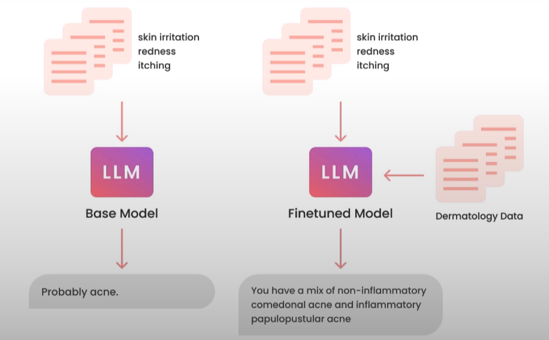

Q-1: What is fine tuning?

Ans- 
> Taking a general purpose model like GPT-3 and specialising them like ChatGPT, GPT-4 and specialising it into GitHub Copilot.

> It's just like a PCP which is a health care practitioner who sees people that have common medical problems, but when specialised can become Neurologist or Radiologist or Cardiologist and look into a specific problem in depth.

Q-2: What fine tuning does?

Ans-
> It lets us put a lot more data into the model as compared to the one provided in the prompt, and let the  model learn from the data, so that model could get upgrade from PCP to a specialised Dermatologist to give specialised output.

As can be seen from the image above, that when the base model (general purpose model) is finetuned over Dermatology data, it gave a very descriptive and specialised information to the symptoms provided by the user.

Q-3: Why should we fine tune LLM?

Ans-
  * It helps in getting more consistent outputs.
  * It helps in resucing hallucinations.
  * It helps in customizing the model to a specific use case (as shown above in the image).