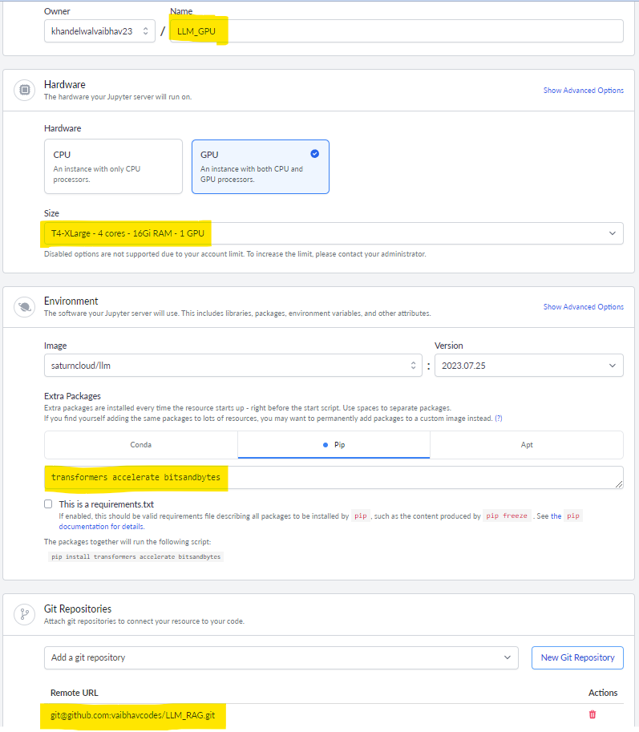

# Large Language Models (LLM)

1. We need an OpenAi key so got to [platform.openai.com](https://platform.openai.com) and register there. Then go to [Dashboard](https://platform.openai.com/assistants) and click on API Keys option.


2. Also, store your key as an environment variable for easy and secure access: 
    ```bash
    export RAG_OPENAI_KEY="Paste the key you have copied from the Openai dashboard"
    ```


3. There are 2 ways to work on this:<br>
3.1. Open codespaces from github, and then select "VS Code Desktop" from the bottom, and install all the libraries mentioned in requirements.txt  


   3.2. Using miniconda:
=> Open VS code and then open Terminal and run the following command:

   => Download miniconda from [here](https://repo.anaconda.com/miniconda/Miniconda3-py310_24.7.1-0-Linux-x86_64.sh)  
    
   => Install it outside your current workspace using the following command:

   ```bash
         bash Miniconda3-py310_24.7.1-0-Linux-x86_64.sh
   ```
   => Install all the libraries mentioned in the requirements.txt

<hr>

4. <b style="color:green; font-size:1.5em"> Working with SaturnCloud </b> <br>

   4.1. Go to the [SaturnCloud](https://saturncloud.io/), and click on <b>Getting a Demo</b>. You will get an email after sometime asking you to SignUp and start working with it. 

   4.2. After logging, go to [Resource](https://app.community.saturnenterprise.io/dash/o/community/resources/jupyterServer) tab, and create a Jupyter Server. Then do the following needful as highlighted in the images attached:
     * Fill the Name
     * Select the Hardware
     * Select the petinent Image and Version
     * Mention the packages to be installed
     * Add the git repository to connect to your resource to your code. 
     * Click on <b>Create</b>, and your Jupyter Server will be created in 10-15 minutes.
    

   4.3. Now to make SSH connection to the Github repositories, go to the [Manage](https://app.community.saturnenterprise.io/dash/o/community/user-details/) tab under <b>User</b> option, and create a new <b>Public Key</b>, and then <b>paste this key</b> under the SSH Key option present in the Github <a href="https://github.com/settings/keys">Settings</a>.

   4.4. Go to [Secrets](https://app.community.saturnenterprise.io/dash/o/community/secrets) tab to store your confidential Access Keys like OpenAi api key, HuggingFace Key, etc.,.

   4.5. Once Jupyter Server gets start, select either of <b>Jupyter Lab</b> OR <b>Jupyter Server</b> as per your preference, and start using the GPU for your AI task.
   
   =>To check the number of GPUs available, run the ollowing command in the notebook:

     ```python
         !nvidia-smi
     ``` 


<hr>